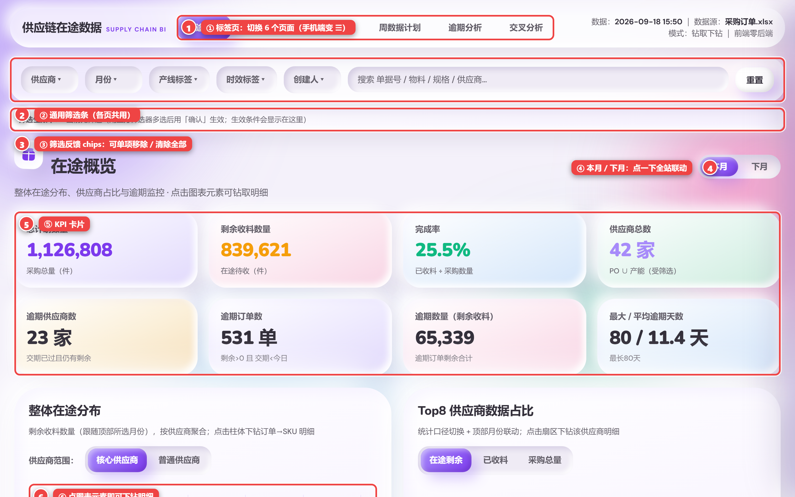
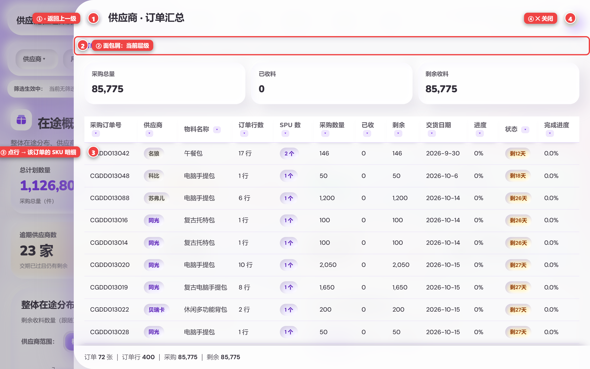
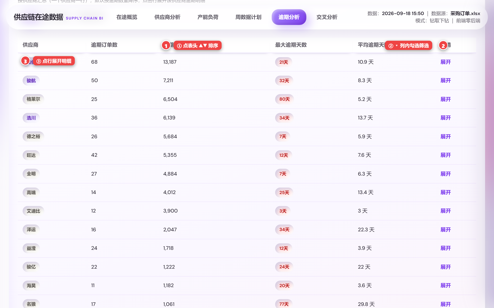
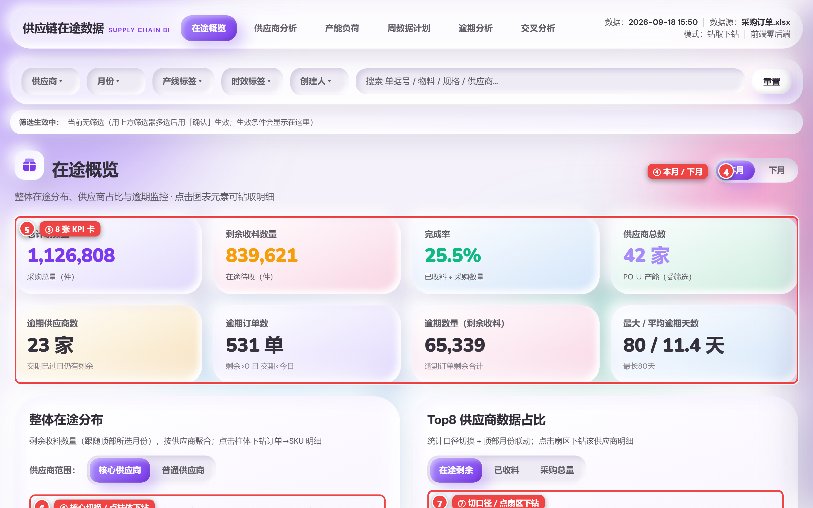
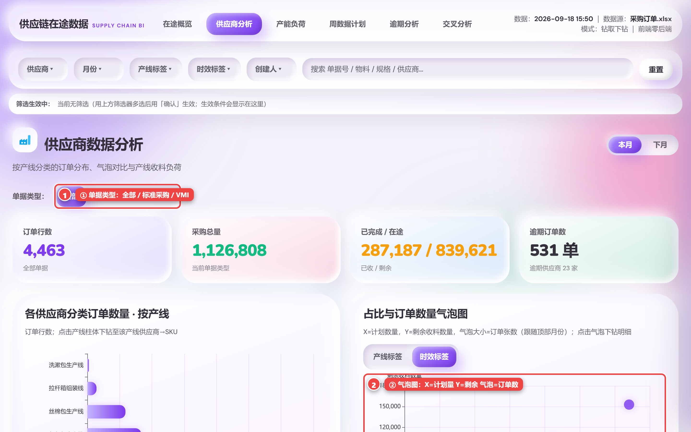
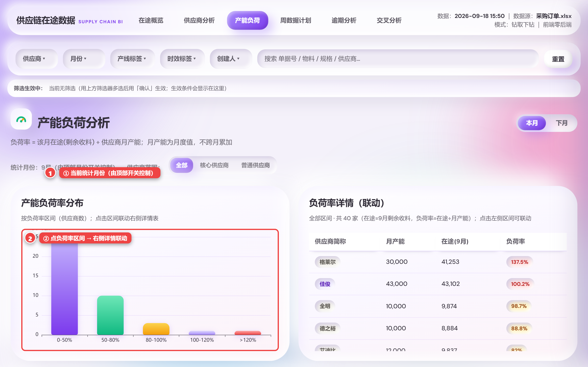
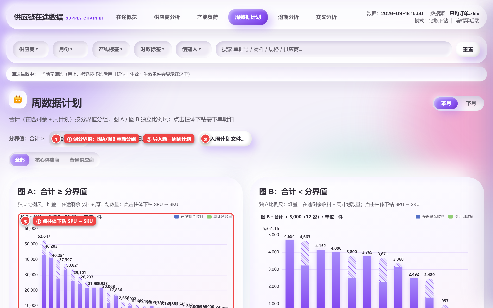
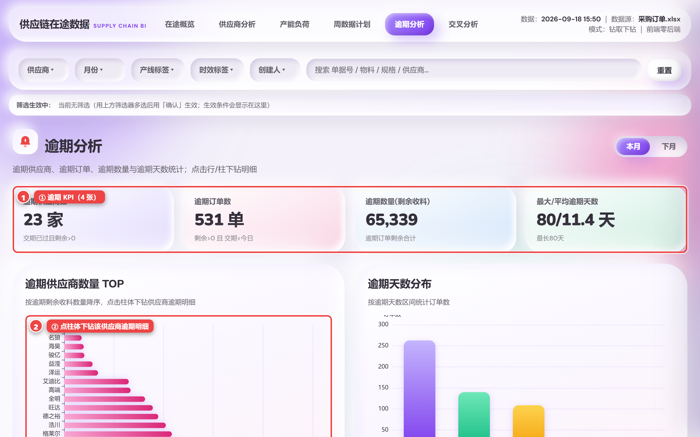
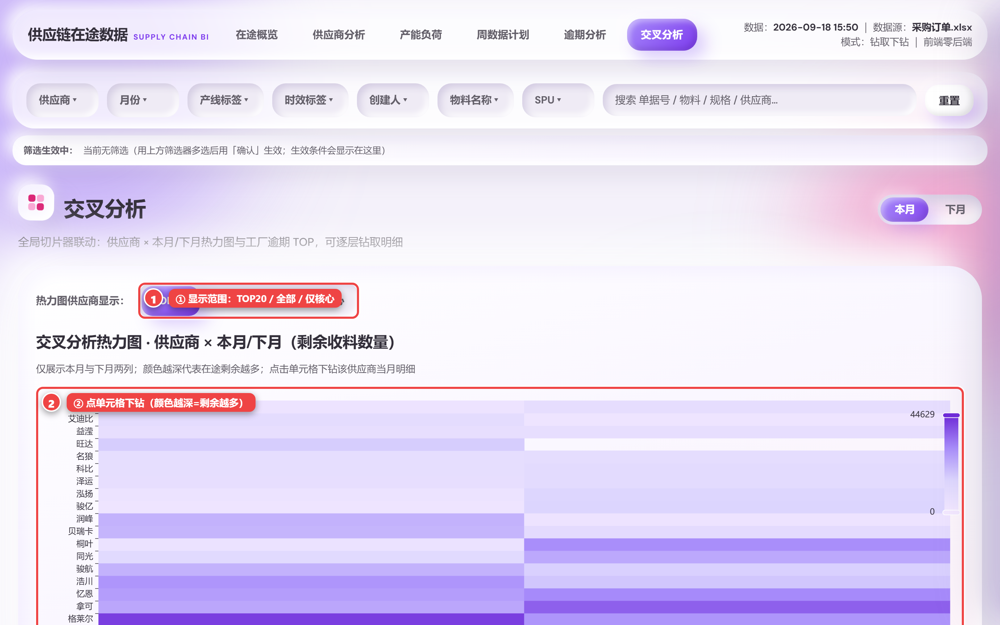

# 供应链在途数据看板 · 新手使用说明与操作指引

> 面向第一次使用本网页的同事。**配图均为看板真实截图**，图中的**红色编号 ①②③…** 对应下方「操作步骤」的编号。
>
> 在线地址：**https://yikeqingsongguo.github.io/HY.supply-chain-management/**

---

## 0. 30 秒了解

- **它是什么**：把采购在途数据（采购订单 + 供应商产能 + 周计划）做成网页看板。纯网页、数据已内嵌，打开即最新。
- **能回答什么**：现在还有多少没到货？谁的完成率低？哪些供应商逾期了？这个月产能吃得下吗？下周要追多少单？
- **一句话用法**：**上面先筛选 → 中间看图表 → 点一下往下钻。**
- **不用装东西**：无后端、无登录、无外部请求。

---

## 1. 第一次打开：整体界面

打开后从上到下是 5 块，对应图中编号：

| 编号 | 区域 | 作用 |
|---|---|---|
| ① | 顶部**标签页** | 切换 6 个页面：在途概览 / 供应商分析 / 产能负荷 / 周数据计划 / 逾期分析 / 交叉分析 |
| ② | **通用筛选条** | 供应商 / 月份 / 产线标签 / 时效标签 / 创建人 + 搜索 + 重置（**每个页面共用**） |
| ③ | **筛选反馈 chips** | 实时显示"你正在筛什么"，可单项移除或一键清除 |
| ④ | **本月 / 下月 开关** | 在每个页面标题右侧，点一下**全站联动** |
| ⑤ | **KPI 卡片** | 关键指标，一眼看全局 |
| ⑥ | **图表 / 表格** | **点柱子、扇区、气泡、行** 即可下钻明细 |

> **手机 / 窄屏**：标签页会折叠成 **☰ 汉堡按钮**，点开再选页面。

---

## 2. 通用操作（在哪个页面都一样）

### 2.1 顶部筛选条怎么用

| 编号 | 控件 | 怎么用 |
|---|---|---|
| ① | 供应商下拉 | 点开**勾选**多个供应商；**清空勾选 = 全部** |
| ② | 月份下拉 | 选 `本月 / 下月 / 全部` |
| ③ | 创建人下拉 | 按采购/创建人过滤 |
| ④ | 搜索框 | 直接打字，跨字段匹配：**单据号 / 物料 / 规格 / 供应商** |
| ⑤ | 重置 | **一键清空所有筛选**，回到全量 |
| ⑥ | 筛选反馈 chips | 见下节 |

### 2.2 筛选反馈 chips：随时知道"我筛了什么"

- 任何筛选生效后，筛选条下方会出现 chips，例如 `供应商：贝瑞卡 ×`、`本月 ×`。
- **点某个 chip 的 ×** → 只移除这一项。
- **点「清除全部」** → 一次性清空。
- 没筛选时显示「当前无筛选」。

### 2.3 本月 / 下月 全局开关

- ① 每个页面都有标题；② 标题右侧是 `本月 / 下月` 按钮。
- **点一下，全站联动**：在途分布、Top8 占比、每日需交、产能负荷、周计划等都会跟着切月。
- ⚠️ **有意不跟随的两处**：**逾期分析** 与 **交叉分析热力图** 始终按**全量 / 双月**展示（方便一眼看全部风险，不是故障）。

### 2.4 点击下钻：看板的核心玩法

- 图上几乎**任何元素都能点**：柱子、扇区、气泡、热力格、表格行、折线点 → 右侧滑出**抽屉**。
- 抽屉是**两级**：
  1. 第一级 **订单汇总**：一行 = 一个采购订单号（含 SPU 数、订单行数）。
  2. 第二级 **SKU 明细**：物料名称 / 规格型号 / SKU / 数量 / 已收 / 剩余 / 交货日期 / 状态。
- 图 ④ 的操作：① 点 `‹` **返回上一级**；② 看面包屑确认当前层级；③ **点某一行** → 进入该订单的 SKU 明细；④ 点 `✕` 关闭。

### 2.5 表格排序与列筛选

- **① 排序**：点表头 **▲▼** 图标，升序/降序切换。
- **② 列内筛选**：关键列表头带 **▾**，点开勾选该列的值（如只看某几个供应商）。
- **③ 点行**：展开/下钻该行明细。
- 明细表会自动带一列 **「完成进度」**；**未满 100% 时保留 1 位小数**（避免"100% 却仍有剩余"的误导）。

---

## 3. 逐页指引（每页：作用 → 操作步骤 → 小贴士）

### 页面 ① 在途概览

**这个页面回答**：整体采购/已收/剩余/完成率如何？谁占大头？哪天要交得最多？

**操作步骤**（对应图中编号）：
1. ④ 用标题右侧 **本月 / 下月** 选择统计月份。
2. ⑤ 看 **8 张 KPI 卡**：总计划数量、剩余收料数量、完成率、供应商总数、逾期供应商数、逾期订单数、逾期数量、最大/平均逾期天数。
3. 「整体在途分布」里切 **核心 / 普通**，**点柱体** → 下钻订单 → SKU。
4. 「Top8 供应商数据占比」里切口径（**在途剩余 / 已收料 / 采购总量**），**点扇区** → 下钻该供应商。
5. 「供应商月度订单数据」表里 **点本月/下月的数字** → 下钻该月该供应商明细。
6. 「每日需交趋势」里 **点数据点** → 下钻当日订单。

**小贴士**：③ 筛选后 chips 会显示当前条件；⑥ 记住"图表都能点"。

---

### 页面 ② 供应商分析

**这个页面回答**：各产线/各时效的订单分布如何？谁订得多但到得少？

**操作步骤**：
1. ① 先选 **单据类型**：全部 / 标准采购 / VMI 采购（影响本页全部数据）。
2. 看 4 张 KPI：订单行数、采购总量、已完成 / 在途、逾期订单数。
3. **气泡图**（②）：**X = 计划数量，Y = 剩余收料数量，气泡大小 = 订单张数**；可切 **产线标签 / 时效标签**，**点气泡** → 下钻。
4. 「各产线收料与负荷汇总表」「时效标签收料与负荷汇总表」：**③ 点「详情」** → 下钻订单 → SKU。

**小贴士**：气泡越大 = 涉及订单越多；越靠右、越靠上 = 订得多且还没到。

---

### 页面 ③ 产能负荷

**这个页面回答**：这个月的在途量，相对供应商月产能有多满？谁超额、谁空闲？

**口径**：负荷率 = 该月**在途（剩余收料）** ÷ 供应商**月产能**；月产能是**月度值，不跨月累加**。

**操作步骤**：
1. ① 确认页面顶部的**统计月份**（由本月/下月开关控制）。
2. ② 点「产能负荷率分布」里的**某个区间** → 右侧**负荷率详情表只显示该区间**的供应商（联动）。
3. 看「超额 / 饱和 / 空闲」三态：**>100% 超额、80–100% 饱和、<80% 空闲**。
4. 点环形图的**扇区**或排序**柱体** → 下钻该供应商。

---

### 页面 ④ 周数据计划

**这个页面回答**：把"在途剩余 + 未来周计划"合起来，谁需要追单？

**口径**：合计 = 在途剩余收料 + 周计划数量；按**分界值**分成图 A（≥）与图 B（<），**两图各自独立比例尺**。

**操作步骤**：
1. ① 调整**分界值**（默认 5000，步长 500）→ 图 A / 图 B 自动重新分组。
2. ② 有新数据时点 **导入周计划文件…** 上传 `.xlsx`（前端预览占位；正式数据走 `clean.py` 更新）。
3. ③ **点柱体** → 下钻「SPU → SKU」。
4. 「各供应商本周计划数量汇总表」里 **点某行** → 下钻该供应商本周计划明细。

---

### 页面 ⑤ 逾期分析

**这个页面回答**：哪些供应商、哪些订单**交期已过却还没交**？

**口径**：逾期 = 交货日期 < 今天 **且** 剩余收料 > 0。

**操作步骤**：
1. ① 看 **4 张逾期 KPI**：逾期供应商数、逾期订单数、逾期数量、最大/平均逾期天数。
2. ② 「逾期供应商数量 TOP」**点柱体** → 下钻该供应商逾期明细。
3. ③ 「逾期供应商汇总表」（一行一家）里 **排序 / 筛选**，**点行** → 展开明细。
4. 本页**不跟随**本月/下月开关，始终展示全量逾期。

---

### 页面 ⑥ 交叉分析

**这个页面回答**：把"供应商 × 本月/下月"的在途量并排对比，谁两月都吃紧？

**操作步骤**：
1. ① 选热力图**显示范围**：`TOP 20 / 全部（可滚动）/ 仅核心`。
2. ② **点某个热力格** → 下钻该供应商**当月**明细。**颜色越深 = 在途剩余越多**。
3. 「工厂逾期数量 TOP」**点柱体** → 下钻该供应商逾期明细。

**小贴士**：本页保持**双月对比全量**，不随本月/下月开关变化。

---

## 4. 操作速查表

| 我想… | 这样做 |
|---|---|
| 只看某几个供应商 | ① 筛选条「供应商」下拉勾选 |
| 只看本月 / 下月 | ② 标题右侧 `本月 / 下月`，或「月份」下拉 |
| 只看核心供应商 | 图上的「核心 / 普通」切换，或筛选条 |
| 看某根柱 / 扇区背后是谁 | **点它** → 右侧抽屉 |
| 从汇总看到具体 SKU | 抽屉里**点订单行** → SKU 明细 |
| 回到上一层 | 抽屉左上角 **`‹`** |
| 按某列排队 | 点表头 **▲▼** |
| 只看某列的部分值 | 点表头 **▾** 勾选 |
| 确认自己筛了什么 | 看筛选条下方 **chips**；点 × 或「清除全部」 |
| 清空所有筛选 | 点 **重置** |

---

## 5. 常见问题（FAQ）

**Q1：为什么「逾期分析 / 交叉分析」点本月/下月没反应？**
A：这两页**刻意**保持全量 / 双月对比，一眼看全部风险，不跟随开关。

**Q2：页面右上角的时间是数据更新时间吗？**
A：那是**页面构建时间**，不是数据时间。判断数据是否更新，看 **KPI 数字有没有变化**。

**Q3：数字和 ERP 对不上？**
A：看板**保留** ERP 中标记「业务关闭」的行（其剩余收料为 0，不影响在途口径），所以采购总量 / 已收量会比"只算在途"的口径大 —— 这是**有意**的，避免低估采购与已收。完成率 = 已收料 ÷ 采购数量。

**Q4：手机上怎么用？**
A：标签页折叠成 **☰ 汉堡按钮**；表格可横向滚动。

**Q5：数据怎么更新？**
A：维护者把新 Excel **同名覆盖**到仓库 `src/`（采购订单.xlsx / 产能.xlsx / 周计划文件），推送后自动构建上线。详见项目 `README.md`。

**Q6：能离线用吗？**
A：可以。`index.html` 是**单文件**，双击即可在浏览器打开，无需网络（数据已内嵌）。
